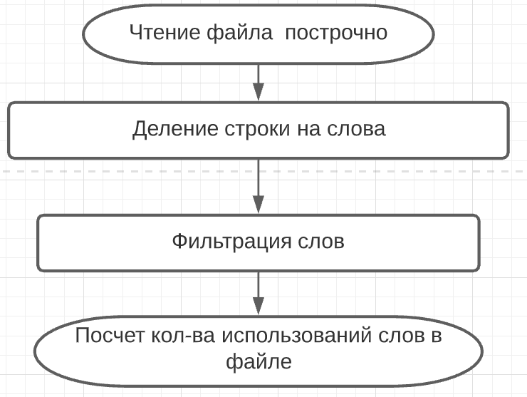

Top 10 word
=====================

Описание проекта
-----------------------------------

Проект выдаёт список из 10-ти самых часто используемых слов, длина которых превышает заданную.
Слова должны подсчитываться в множестве текстовых файлов в указанной папке.

Архитектура приложения построена на поэтапной обработке потока информации процессом.
Процессом является определенная последовательность выполняемых работ, начиная со стартовой и заканчивая конечной работами.

**StarterProcessService** - начальная точка запуска процесса;

**QueueWorkerService** - часть процесса по преобразованию и отсеиванию данных;

**TerminalProcessService** - конечная точка процесса, возвращающая результат;

**BuilderProcessService** - строит последовательность выполнения процесса. Процесс состоит как минимум из начальной и конечной работ;

**ProcessRunnerService** - запускает определенный в *BuilderProcessService* процесс и возвращает конечный результат.

Процесс по подсчету кол-ва слов в файле выглядит так:

Далее ищется топ 10 самых часто используемых слов в сервисе TopTenWordService. 

Используемые технологии
-----------------------------------

* Spring Boot.

Основные используемые библиотеки
-----------------------------------

* java.util.concurrent.BlockingQueue;
* java.util.concurrent.CompletableFuture;
* org.apache.commons.io.FileUtils.

Настройка окружения
-----------------------------------

* Java version 1.8;
* Maven3.

Описание параметров в файле application.properties:
-----------------------------------

*folder.path* - путь до папки с файлами;

*delimiter.regExp* - разделить между словами;

*word.length* - минимальная длина слова.

***Необязательные параметры:***

*starter.thread.pool.size* - кол-во потоков для начальных работ в процессе;

*worker.thread.pool.size* - кол-во потоков для промежуточных работ в процессе;

*terminated.thread.pool.size* - кол-во потоков для конечных работ в процессе;

*starter.queue.size* - размер очереди для начальных работ в процессе;

*worker.queue.size* - размер очереди для промежуточных работ в процессе;

Запуск
-----------------------------------

* Установить зависимости и собрать jar: _mvn clean install_;
* Запустить полученный jar файл: java -jar top10word-1.0-SNAPSHOT.jar --folder.path=***ПУТЬ ДО ФАЙЛА***